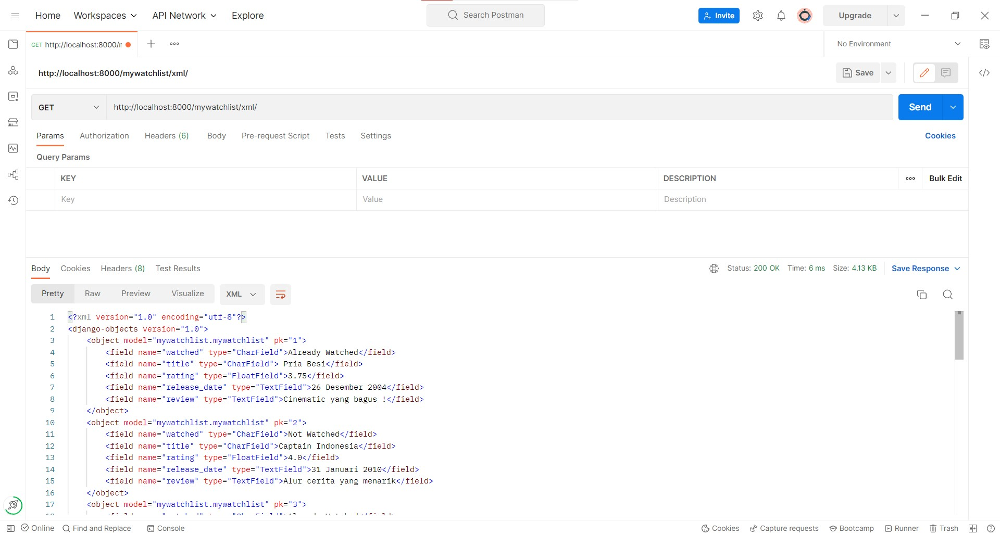

## My Watchlist  
[Home page](https://tugas2pbpirsyad.herokuapp.com/)

[HTML page](https://tugas2pbpirsyad.herokuapp.com/mywatchlist/html/)

[XML page](https://tugas2pbpirsyad.herokuapp.com/mywatchlist/xml/)

[JSON page](https://tugas2pbpirsyad.herokuapp.com/mywatchlist/json/)

## Perbedaan antara JSON, XML, dan HTML
* Hypertext Markup Language merupakan markup language atau biasa disebut HTML yang bertujuan untuk menyusun stuktur sebuah aplikasi web yang bisa diatur penyajian penampilannya yang mana didalamnya terdapat data yang direpresentasikan dalam element tree. Hal yang membedakan HTML dan XML nantinya, yakni HTML memiliki fungsi yang condong untuk penampilan data sedangkan XML lebih condong untuk penyimpanan dan pentransferan data
* JavaScript Object Notation atau biasa disebut JSON merupakan sebuah format yang menggunakan bentuk javascript dan menggunakan key serta value untuk merepresentasikan data sehingga dapat dikatan efisien. Namun dibandingkan dengan HTML serta XML, JSON kurang rapih untuk dilihat dikarenakan tag tidak digunakan selayaknya HTML dan XML. Hanya saja, karena alasan tersebut serta ukurannya yang lebih ringan, pengaksesan dan pembacaan JSON lebih cepat dibanding kedua hal tersebut.
* Extensive Markup Languageatau biasa disebut XML merupakan salah satu markup language yang digunakan untuk penyimpanan serta pengantaran data yang lebih mudah dibaca karena menggunakan tag-tag namun ketika dibandingkan JSON, XML akan terasa lebih sulit untuk dibaca

## Alasan data delivery diperlukan dalam pengimplementasian sebuah platform
- Alasan data delivery diperlukan dalam pengimplementasian sebuah platform adalah demi mempermudah untuk melakukan pengemasan serta pengiriman data yang mana pertukaran data antara user dan server akan sering terjadi dalam sebuah platform sehingga diperlukan suatu bahasa seperti HTML,JSON serta XML yang mudah untuk dipahami, baik oleh komputer maupun manusia itu sendiri

## Implementasi
1. Hal yang pertama dilakukan adalah pada direktori tugas2 melakukan perintah pada python yakni python manage.py startapp mywatchlist untuk melakukan pembuatan aplikasi 'mywatchlist'
2. Penghubungan urlpatterns yang terdapat pada project_django dengan mywatchlist dengan melakukan pengroutean url dengan menambahkan path('mywatchlist/', include('mywatchlist.urls')) dan pada setting.py dilakukan penambahan mywatchlist pada installed_app. Langkah berikutnya adalah penghubungan fungsi yang nantinya akan dieksekusi pada mywatchlist/views.py dengan melaksanakan path route dalam mywatchlist/urls.py
3. Mengset fields watched, title, rating, release_date, review pada mywatchlist/models.py dengan tujuan pembuatan model data. Selanjutnya,  migrasi dilakukan dengan melakukan command python manage.py makemigrations serta python manage.py migrate.
4. Pembuatan file initial_mywatchlist_data.json dengan tujuan pengisian 10 data dan nantinya akan di load sehingga dapat ditampilkan di url yang dibuat di dalam folder fixtures yang dibuat terlebih dahulu
5. menampilkan data dalam bentuk html,json, serta xml pada file views.py dengan cara membuat implementasi fungsi.  fungsi render dan pada json/xml digunakan pada html dan fungsi HttpResponse digunakan pada json/xml
6. Penambahan routing untuk html,json, dan xml sama seperti pada point 2. Hanya saja ada penamabahan kembali url di path urls di folder mywatchlist

## POSTMAN

## HTML

## XML

## JSON
